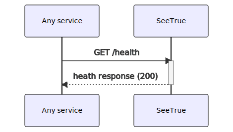

# SeeTrue.API

## Healthchek
Path

```
/health
```

Method:
```
GET
```

Diagram



Response
```typescript
{
  "name": string,
  "version": 0,
  "description": string
}
```

## Settings
Path

```
/settings
```

Method:
```
GET
```

Diagram


Response
```typescript
{
  "signup_disabled": boolean,
  "autoconfirm": boolean
}
```

## Signup

Description:
Creates a user based on the request data, if SeeTrue autoconfirm is enabled, the created user is created and the user can login right after the signup, if not, the user gets an email which enables him to confirm this signup.


Path:
```
/signup
```
Method:
```
POST
```
Request body:
```typescript
{
  email: string,
  password: string,
  language: string,
  userMetaData: {
    Name: string,
    ...
    [key:string]: value,
  }
}
```
Example response:
```json
{
  "instanceID": "3fa85f64-5717-4562-b3fc-2c963f66afa6",
  "id": "3fa85f64-5717-4562-b3fc-2c963f66afa6",
  "aud": "string",
  "role": "string",
  "email": "string",
  "language": "string",
  "confirmedAt": "2022-01-23T16:49:35.563Z",
  "invitedAt": "2022-01-23T16:49:35.563Z",
  "recoverySentAt": "2022-01-23T16:49:35.563Z",
  "emailChange": "string",
  "emailChangeSentAt": "2022-01-23T16:49:35.563Z",
  "lastSignInAt": "2022-01-23T16:49:35.563Z",
  "appMetaData": {
    "additionalProp1": "string",
    "additionalProp2": "string",
    "additionalProp3": "string"
  },
  "userMetaData": {
    "additionalProp1": "string",
    "additionalProp2": "string",
    "additionalProp3": "string"
  },
  "isSuperAdmin": true,
  "createdAt": "2022-01-23T16:49:35.563Z",
  "updatedAt": "2022-01-23T16:49:35.563Z"
}
```


## TokenRequest
Path:

```
/token
```

Diagram:

