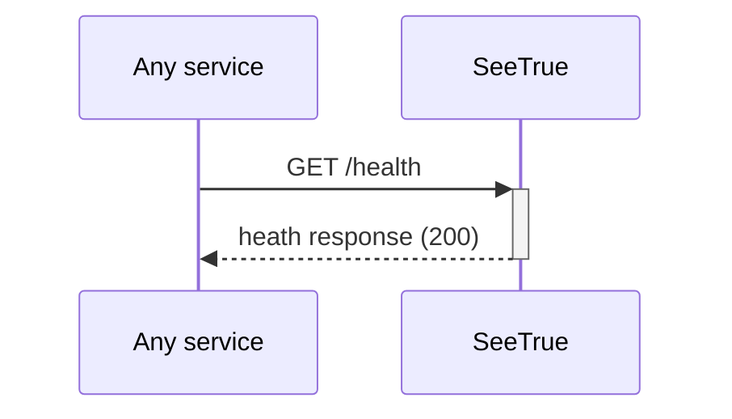
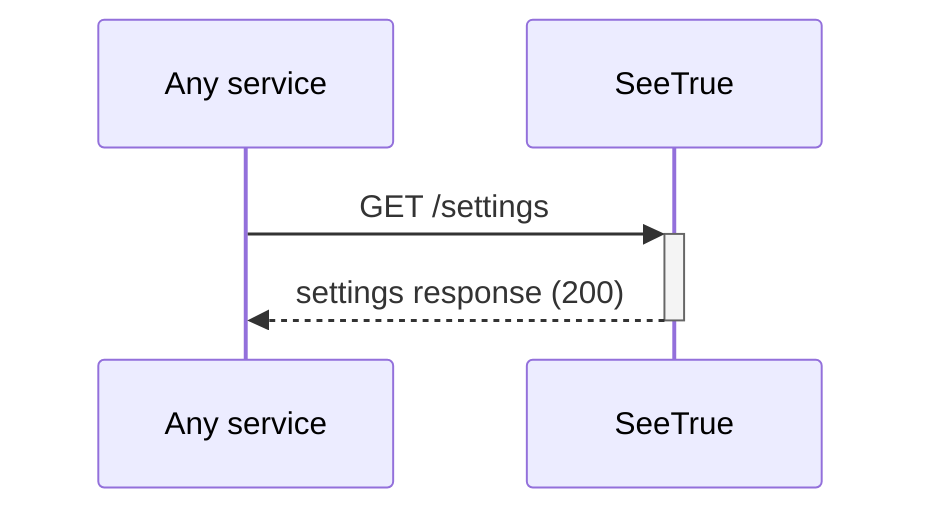
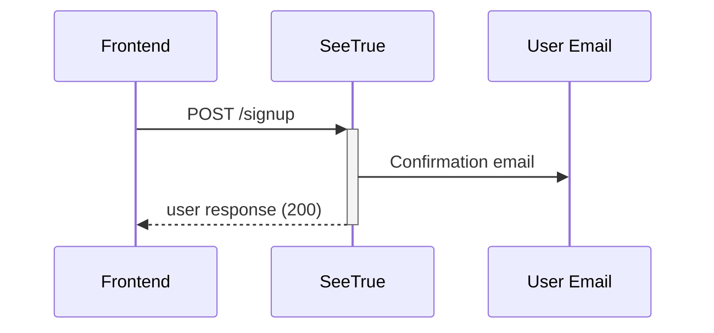
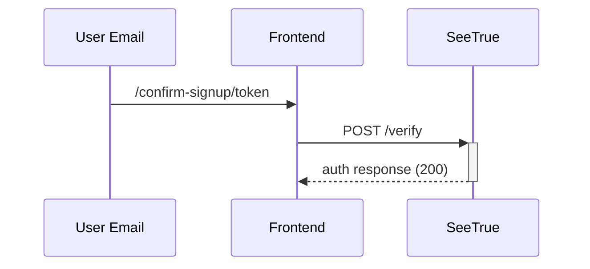
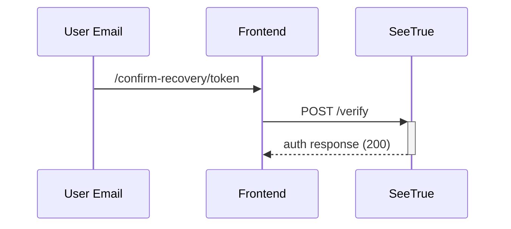
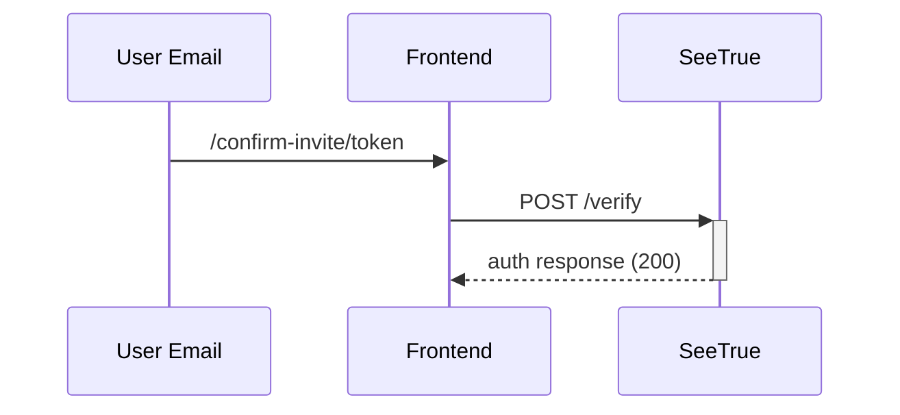
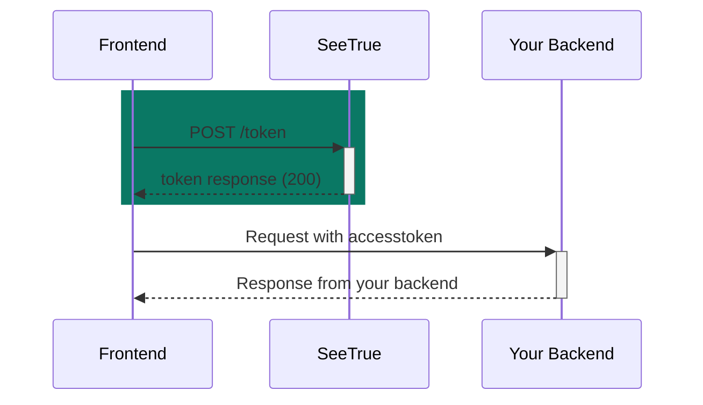
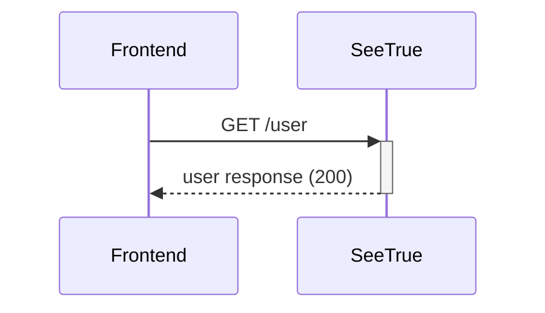
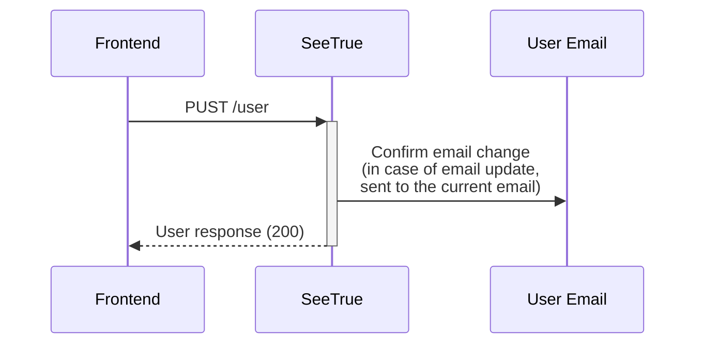
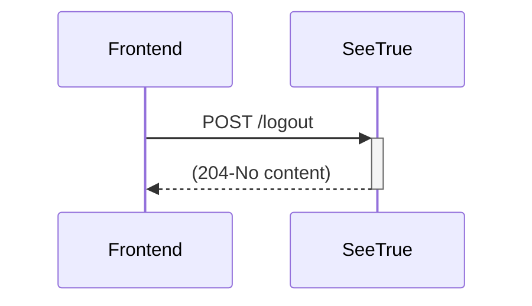

# SeeTrue.API

## Healthchek
Returns basic app information, confirms that the app is running.



Path

```
/health
```

Method:
```
GET
```

Response
```typescript
{
  "name": string,
  "version": 0,
  "description": string
}
```

## Settings
Gets SeeTrue settings



Path

```
/settings
```

Method:
```
GET
```

Response
```typescript
{
  "signup_disabled": boolean,
  "autoconfirm": boolean
}
```

## Signup

Creates a user based on the request data, if SeeTrue autoconfirm is enabled, the created user is created and the user can login right after the signup, if not, the user gets an email which enables him to confirm this signup.



Path:
```
/signup
```
Method:
```
POST
```
Headers:
```typescript
{
  'Content-Type': 'application/json',
  'X-JWT-AUD': {audince}, // audience specified in SeeTrue config
}
```
Request body:
```typescript
{
  email: string, // required, must be an email
  password: string, // requered, min length configured in SeeTrue env
  language: string, // required, supported languages configured in SeeTrue env
  userMetaData: { // key value object, here you can store custom user data
    Name: string, // Name is required, used in emails
    ...
    [key:string]: value,
  }
}
```
Example response:
```json
{
  "instanceID": "3fa85f64-5717-4562-b3fc-2c963f66afa6",
  "id": "3fa85f64-5717-4562-b3fc-2c963f66afa6",
  "aud": "string",
  "role": "string",
  "email": "string",
  "language": "string",
  "confirmedAt": "2022-01-23T16:49:35.563Z",
  "invitedAt": "2022-01-23T16:49:35.563Z",
  "recoverySentAt": "2022-01-23T16:49:35.563Z",
  "emailChange": "string",
  "emailChangeSentAt": "2022-01-23T16:49:35.563Z",
  "lastSignInAt": "2022-01-23T16:49:35.563Z",
  "appMetaData": {
    "additionalProp1": "string",
    "additionalProp2": "string",
    "additionalProp3": "string"
  },
  "userMetaData": {
    "additionalProp1": "string",
    "additionalProp2": "string",
    "additionalProp3": "string"
  },
  "isSuperAdmin": true,
  "createdAt": "2022-01-23T16:49:35.563Z",
  "updatedAt": "2022-01-23T16:49:35.563Z"
}
```

## Verify
Verifies user signup, recovery or invite based on a token which the user gets in an email. The frontend urls are specified in the email templates.

### Verify signup

Verifies a user signup.



Path:
```
/verfy
```
Method:
```
POST
```
Headers:
```typescript
{
  'Content-Type': 'application/json',
  'X-JWT-AUD': {audince}, // audience specified in SeeTrue config
}
```

Request body:
```typescript
{
  type: "signup",
  token: string,
}
```
Example response:
```json
{
  "access_token": "string",
  "token_type": "string",
  "expires_in": 0,
  "refresh_token": "string",
  "user": {
    "instanceID": "3fa85f64-5717-4562-b3fc-2c963f66afa6",
    "id": "3fa85f64-5717-4562-b3fc-2c963f66afa6",
    "aud": "string",
    "role": "string",
    "email": "string",
    "language": "string",
    "confirmedAt": "2022-01-23T17:14:09.661Z",
    "invitedAt": "2022-01-23T17:14:09.661Z",
    "recoverySentAt": "2022-01-23T17:14:09.661Z",
    "emailChange": "string",
    "emailChangeSentAt": "2022-01-23T17:14:09.661Z",
    "lastSignInAt": "2022-01-23T17:14:09.661Z",
    "appMetaData": {
      "additionalProp1": "string",
      "additionalProp2": "string",
      "additionalProp3": "string"
    },
    "userMetaData": {
      "additionalProp1": "string",
      "additionalProp2": "string",
      "additionalProp3": "string"
    },
    "isSuperAdmin": true,
    "createdAt": "2022-01-23T17:14:09.661Z",
    "updatedAt": "2022-01-23T17:14:09.661Z"
  }
}
```
### Verify recovery

Verifies a user recovery.



Path:
```
/verfy
```
Method:
```
POST
```

Headers:
```typescript
{
  'Content-Type': 'application/json',
  'X-JWT-AUD': {audince}, // audience specified in SeeTrue config
}
```

Request body:
```typescript
{
  type: "recovery",
  token: string,
}
```
Example response:
```json
{
  "access_token": "string",
  "token_type": "string",
  "expires_in": 0,
  "refresh_token": "string",
  "user": {
    "instanceID": "3fa85f64-5717-4562-b3fc-2c963f66afa6",
    "id": "3fa85f64-5717-4562-b3fc-2c963f66afa6",
    "aud": "string",
    "role": "string",
    "email": "string",
    "language": "string",
    "confirmedAt": "2022-01-23T17:14:09.661Z",
    "invitedAt": "2022-01-23T17:14:09.661Z",
    "recoverySentAt": "2022-01-23T17:14:09.661Z",
    "emailChange": "string",
    "emailChangeSentAt": "2022-01-23T17:14:09.661Z",
    "lastSignInAt": "2022-01-23T17:14:09.661Z",
    "appMetaData": {
      "additionalProp1": "string",
      "additionalProp2": "string",
      "additionalProp3": "string"
    },
    "userMetaData": {
      "additionalProp1": "string",
      "additionalProp2": "string",
      "additionalProp3": "string"
    },
    "isSuperAdmin": true,
    "createdAt": "2022-01-23T17:14:09.661Z",
    "updatedAt": "2022-01-23T17:14:09.661Z"
  }
}
```

### Verify invite

Verifies a user invite.



Path:
```
/verfy
```
Method:
```
POST
```
Headers:
```typescript
{
  'Content-Type': 'application/json',
  'X-JWT-AUD': {audince}, // audience specified in SeeTrue config
}
```

Request body:
```typescript
{
  type: "invite",
  token: string,
  password: string,
  name: string
}
```
Example response:
```json
{
  "access_token": "string",
  "token_type": "string",
  "expires_in": 0,
  "refresh_token": "string",
  "user": {
    "instanceID": "3fa85f64-5717-4562-b3fc-2c963f66afa6",
    "id": "3fa85f64-5717-4562-b3fc-2c963f66afa6",
    "aud": "string",
    "role": "string",
    "email": "string",
    "language": "string",
    "confirmedAt": "2022-01-23T17:14:09.661Z",
    "invitedAt": "2022-01-23T17:14:09.661Z",
    "recoverySentAt": "2022-01-23T17:14:09.661Z",
    "emailChange": "string",
    "emailChangeSentAt": "2022-01-23T17:14:09.661Z",
    "lastSignInAt": "2022-01-23T17:14:09.661Z",
    "appMetaData": {
      "additionalProp1": "string",
      "additionalProp2": "string",
      "additionalProp3": "string"
    },
    "userMetaData": {
      "additionalProp1": "string",
      "additionalProp2": "string",
      "additionalProp3": "string"
    },
    "isSuperAdmin": true,
    "createdAt": "2022-01-23T17:14:09.661Z",
    "updatedAt": "2022-01-23T17:14:09.661Z"
  }
}
```

## TokenRequest

Request a token from SeeTrue, use this token to communicate with your backend. You can request a token
- By sign in (using an email password combo)
- By refresh (using a refresh token)

You need to validate these tokens on your side, most of the times you can download a package which handles that for you, use the same values for you validation logis as for the SeeTrue environment config.


### Password token request
Path:

```
/token
```
Method:
```
POST
```
Headers:
```typescript
{
  'Content-Type': 'application/json',
  'X-JWT-AUD': {audince}, // audience specified in SeeTrue config
}
```

Request body:
```typescript
{
  "grant_type": "password",
  "email": "string",
  "password": "string",
  "refresh_token": "string"
}
```

Example response:
```json
{
  "access_token": "string",
  "token_type": "string",
  "expires_in": 0,
  "refresh_token": "string",
  "user": {
    "instanceID": "3fa85f64-5717-4562-b3fc-2c963f66afa6",
    "id": "3fa85f64-5717-4562-b3fc-2c963f66afa6",
    "aud": "string",
    "role": "string",
    "email": "string",
    "language": "string",
    "confirmedAt": "2022-01-23T17:14:09.661Z",
    "invitedAt": "2022-01-23T17:14:09.661Z",
    "recoverySentAt": "2022-01-23T17:14:09.661Z",
    "emailChange": "string",
    "emailChangeSentAt": "2022-01-23T17:14:09.661Z",
    "lastSignInAt": "2022-01-23T17:14:09.661Z",
    "appMetaData": {
      "additionalProp1": "string",
      "additionalProp2": "string",
      "additionalProp3": "string"
    },
    "userMetaData": {
      "additionalProp1": "string",
      "additionalProp2": "string",
      "additionalProp3": "string"
    },
    "isSuperAdmin": true,
    "createdAt": "2022-01-23T17:14:09.661Z",
    "updatedAt": "2022-01-23T17:14:09.661Z"
  }
}
```

### Refresh token request

Path:

```
/token
```
Method:
```
POST
```

Headers:
```typescript
{
  'Content-Type': 'application/json',
  'X-JWT-AUD': {audince}, // audience specified in SeeTrue config
}
```

Request body:
```typescript
{
  "grant_type": "refresh_token",
  "refresh_token": "string"
}
```

Example response:
```json
{
  "access_token": "string",
  "token_type": "string",
  "expires_in": 0,
  "refresh_token": "string",
  "user": {
    "instanceID": "3fa85f64-5717-4562-b3fc-2c963f66afa6",
    "id": "3fa85f64-5717-4562-b3fc-2c963f66afa6",
    "aud": "string",
    "role": "string",
    "email": "string",
    "language": "string",
    "confirmedAt": "2022-01-23T17:14:09.661Z",
    "invitedAt": "2022-01-23T17:14:09.661Z",
    "recoverySentAt": "2022-01-23T17:14:09.661Z",
    "emailChange": "string",
    "emailChangeSentAt": "2022-01-23T17:14:09.661Z",
    "lastSignInAt": "2022-01-23T17:14:09.661Z",
    "appMetaData": {
      "additionalProp1": "string",
      "additionalProp2": "string",
      "additionalProp3": "string"
    },
    "userMetaData": {
      "additionalProp1": "string",
      "additionalProp2": "string",
      "additionalProp3": "string"
    },
    "isSuperAdmin": true,
    "createdAt": "2022-01-23T17:14:09.661Z",
    "updatedAt": "2022-01-23T17:14:09.661Z"
  }
}
```

## User
Gets the current users data



Path:

```
/user
```
Method:
```
GET
```

Headers:
```typescript
{
  'X-JWT-AUD': audince, // audience specified in SeeTrue config
  'authorization': 'Bearer {access_token}' // use your accesstoken 
}
```

Example response:
```json
{
  "instanceID": "3fa85f64-5717-4562-b3fc-2c963f66afa6",
  "id": "3fa85f64-5717-4562-b3fc-2c963f66afa6",
  "aud": "string",
  "role": "string",
  "email": "string",
  "language": "string",
  "confirmedAt": "2022-01-23T17:14:09.661Z",
  "invitedAt": "2022-01-23T17:14:09.661Z",
  "recoverySentAt": "2022-01-23T17:14:09.661Z",
  "emailChange": "string",
  "emailChangeSentAt": "2022-01-23T17:14:09.661Z",
  "lastSignInAt": "2022-01-23T17:14:09.661Z",
  "appMetaData": {
    "additionalProp1": "string",
    "additionalProp2": "string",
    "additionalProp3": "string"
  },
  "userMetaData": {
    "additionalProp1": "string",
    "additionalProp2": "string",
    "additionalProp3": "string"
  },
  "isSuperAdmin": true,
  "createdAt": "2022-01-23T17:14:09.661Z",
  "updatedAt": "2022-01-23T17:14:09.661Z"
}
```

## Update User
Updates the user object in the database. Metadata will ovveride existing keys, add non existing keys and if you want to remove a metadata value, set it to null. In case of email update, an email update confirmation is required. Every field is optional.



Path:
```
/user
```
Method:
```
PUT
```
Headers:
```typescript
{
  'X-JWT-AUD': audince, // audience specified in SeeTrue config
  'authorization': 'Bearer {access_token}' // use your accesstoken 
}
```
Example response:
```json
{
  "instanceID": "3fa85f64-5717-4562-b3fc-2c963f66afa6",
  "id": "3fa85f64-5717-4562-b3fc-2c963f66afa6",
  "aud": "string",
  "role": "string",
  "email": "string",
  "language": "string",
  "confirmedAt": "2022-01-23T17:14:09.661Z",
  "invitedAt": "2022-01-23T17:14:09.661Z",
  "recoverySentAt": "2022-01-23T17:14:09.661Z",
  "emailChange": "string",
  "emailChangeSentAt": "2022-01-23T17:14:09.661Z",
  "lastSignInAt": "2022-01-23T17:14:09.661Z",
  "appMetaData": {
    "additionalProp1": "string",
    "additionalProp2": "string",
    "additionalProp3": "string"
  },
  "userMetaData": {
    "additionalProp1": "string",
    "additionalProp2": "string",
    "additionalProp3": "string"
  },
  "isSuperAdmin": true,
  "createdAt": "2022-01-23T17:14:09.661Z",
  "updatedAt": "2022-01-23T17:14:09.661Z"
}
```

## Logout
Revokes all the refresh tokens connected to the given login, Revokes all the access tokens connected to the given login. 



Path:

```
/logout
```
Method:
```
POST
```

Headers:
```typescript
{
  'X-JWT-AUD': audince, // audience specified in SeeTrue config
  'authorization': 'Bearer {access_token}' // use your accesstoken 
}
```
Response:

statuscode 204, status No content

## Recover
Request a recovery token, which is used to start a password recovery process. 

```mermaid
sequenceDiagram
    sequenceDiagram
    Frontend->>+SeeTrue: POST /recover
    SeeTrue->>User Email: Recovery email
    SeeTrue-->>-Frontend: (204-No content)
```

Path:

```
/recover
```
Method:
```
POST
```

Headers:
```typescript
{
  'Content-Type': 'application/json',
  'X-JWT-AUD': {audince}, // audience specif
}
```
Request body:
```typescript
{
  email: string, // required, must be an email
}
```

Response:

statuscode 204, status No content