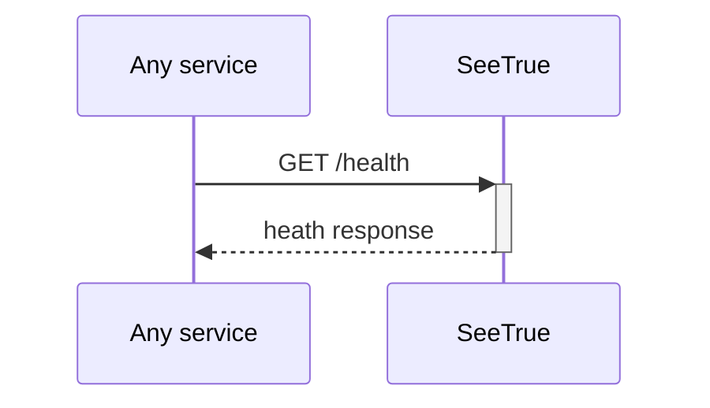
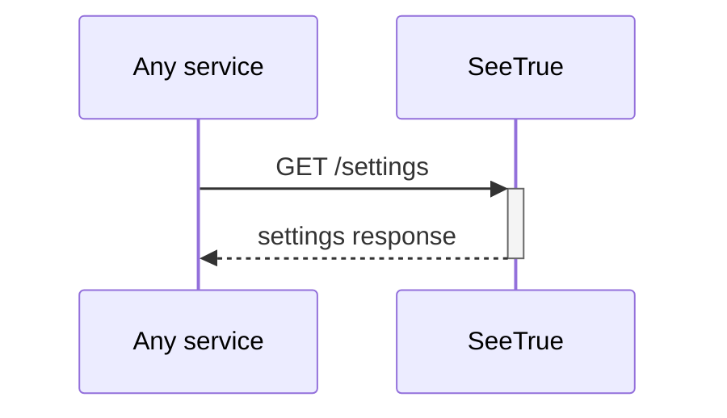
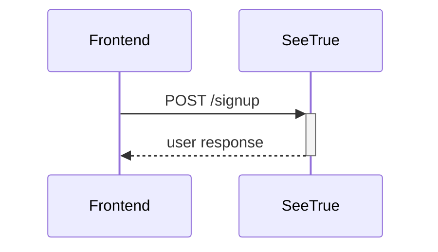
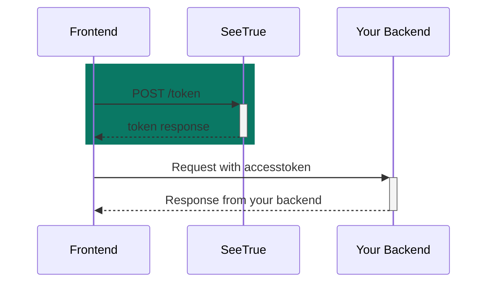

# SeeTrue.API

## Healthchek
Returns basic app information, confirms that the app is running.



Path

```
/health
```

Method:
```
GET
```

Response
```typescript
{
  "name": string,
  "version": 0,
  "description": string
}
```

## Settings
Gets SeeTrue settings



Path

```
/settings
```

Method:
```
GET
```

Response
```typescript
{
  "signup_disabled": boolean,
  "autoconfirm": boolean
}
```

## Signup

Creates a user based on the request data, if SeeTrue autoconfirm is enabled, the created user is created and the user can login right after the signup, if not, the user gets an email which enables him to confirm this signup.



Path:
```
/signup
```
Method:
```
POST
```
Headers:
```typescript
'Content-Type': 'application/json',
'X-JWT-AUD': audince, // must be configured in SeeTrue env
```
Request body:
```typescript
{
  email: string, // required, must be an email
  password: string, // requered, min length configured in SeeTrue env
  language: string, // required, supported languages configured in SeeTrue env
  userMetaData: { // key value object
    Name: string, // Name is required, used in emails
    ...
    [key:string]: value,
  }
}
```
Example response:
```json
{
  "instanceID": "3fa85f64-5717-4562-b3fc-2c963f66afa6",
  "id": "3fa85f64-5717-4562-b3fc-2c963f66afa6",
  "aud": "string",
  "role": "string",
  "email": "string",
  "language": "string",
  "confirmedAt": "2022-01-23T16:49:35.563Z",
  "invitedAt": "2022-01-23T16:49:35.563Z",
  "recoverySentAt": "2022-01-23T16:49:35.563Z",
  "emailChange": "string",
  "emailChangeSentAt": "2022-01-23T16:49:35.563Z",
  "lastSignInAt": "2022-01-23T16:49:35.563Z",
  "appMetaData": {
    "additionalProp1": "string",
    "additionalProp2": "string",
    "additionalProp3": "string"
  },
  "userMetaData": {
    "additionalProp1": "string",
    "additionalProp2": "string",
    "additionalProp3": "string"
  },
  "isSuperAdmin": true,
  "createdAt": "2022-01-23T16:49:35.563Z",
  "updatedAt": "2022-01-23T16:49:35.563Z"
}
```


## TokenRequest
Path:

```
/token
```

Diagram:

